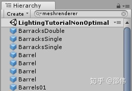
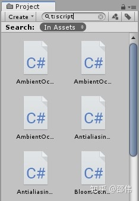

2.Pixel Perfect Camera

在摄像机上挂载Pixel Perfect Camera组件能够使2D像素风格的游戏画面更加整洁清晰。此组件需要使用Package Manager安装2D Pixel Perfect包。

4. 延迟销毁游戏对象

默认情况下，使用Destroy()方法会立即销毁游戏对象，如果想延迟一段时间再销毁，可在此方法中传递一个时间参数，如下：

Destroy(gameObject,2f);

6. 脚本不挂载到游戏对象执行

通常情况下，新建的脚本要挂载到游戏对象上才能运行，如果在脚本中的方法前使用[RuntimeInitializeOnLoadMethod(RuntimeInitializeLoadType.AfterSceneLoad)]，可以不用挂载到任何游戏对象上即可在程序运行时执行此方法，方便在在程序初始化前做一些额外的初始化工作。如下代码所示：

[RuntimeInitializeOnLoadMethod(RuntimeInitializeLoadType.AfterSceneLoad)]
public static void DoSomething()
{
    Debug.Log("It's the start of the game");
}

8. 获取一个随机布尔值

我们知道Random.value能够返回0~1之间的随机数，所以让此随机数与0.5f进行比较，就能够获取一个随机的布尔值True或者False，如下代码所示：

bool trueOrFalse = (Random.value > 0.5f);

9. 使用Struct代替Class

如果数据结构仅保存了有限的几个数值变量，可以考虑使用struct代替Class，因为Class实例由垃圾回收机制来保证内存的回收处理;而struct变量使用完后立即自动解除内存分配。

11.协程嵌套

在一个协程里开启另外一个协程，可使用以下方法：

void Start()
{
    StartCoroutine(FirstCo());
}

IEnumerator FirstCo()
{
    yield return StartCoroutine(SecondCo());
}

IEnumerator SecondCo()
{
    yield return 0;
}

12.脚本变量参与动画制作

使用Animation工具还可以改变脚本的变量。

13/14. Animation窗口快捷键

在Animation窗口中，按下Ctrl+A，所有关键帧将集中显示在窗口中；选择某些关键帧，按下F键，可将它们居中显示在窗口中；按下C键，可以在曲线视图和关键帧视图间切换；按下K键添加关键帧。

16.快速比较距离

将两点之间的距离与一个固定距离进行比较时，可使两点相减然后取平方（即sqrMagnitude），然后用该值与某个距离值的平方进行比较。不建议使用Vector3.Distance方法获取两点之间距离，然后与给定的距离值进行比较。因为Vector3.Distance(a,b) 相当于 (a-b).magnitude，即求平方后开根，而sqrMagnitude方法省去了求平方根的操作，所以比magnitude执行快。

建议：

if ((pointA - pointB).sqrMagnitude < dist * dist)
{
}

不建议：

if (Vector3.Distance(pointA, pointB) < dist)
{
}

17. 使用TextMeshPro

使用TextMeshPro能够获得更多的文字控制自由度，并且能够有效防止文字边缘模糊。如下图所示，第一行文字通过"Create > UI > Text"命令创建，第二行文字通过"Create > UI > TextMeshPro - Text"命令创建。

19. 在Inspector面板中隐藏公有变量

如果不希望在Inspector面板中显示公有变量，可将其标记为[HideInInspector]。

[HideInInspector]
public int myNumber = 20;

20. 变量重命名后继续保持值

当变量重命名后，如果希望继续保留其数值，可使用FormerlySerializedAs，如下代码所示：

[FormerlySerializedAs("hp")]
public int myNumber = 20;

需要引用命名空间：

using UnityEngine.Serialization;

21.使用文件夹快捷方式

可将经常访问的文件夹的快捷方式拖入Project面板中，双击快捷方式可快速打开此目录。

22/23.F与Shift+F

选择游戏对象，按下F键，可将Scene的视口中央移动到该游戏对象处；按下Shift+F，可将视口与该游戏对象锁定，即无论如何移动游戏对象，视口中央始终跟随此游戏对象。

25. CompareTag方法

当对游戏对象的Tag进行比对时，从性能考虑，可使用CompareTag方法，不建议使用双等号进行判断。

建议：

if (gameObject.CompareTag("Enemy"))
{

}

不建议：

if (gameObject.tag == "Enemy")
{

}
26.使用空游戏对象作为分隔符

在Hierarchy面板中，可以使用名称中带有分隔符的空游戏对象进行组织管理。

27. 查找含有某组件的游戏对象

如果需要查找挂载了某个组件的游戏对象，直接在Hierarchy面板的搜索框中输入组件名称即可，需要注意组件名称中的空格，比如搜索”MeshCollider“而不是”Mesh Collider“。

28. 查找某种类型的资源

在Project面板中的搜索框中输入"t:"+资源类型，可以过滤显示某种类型的资源，比如输入"t:scene"，会过滤出所有场景文件，输入"t:texture"，则会显示所有贴图。

37.MenuItem属性

要在编辑器的菜单栏中选择执行编写的函数，可在函数前添加MenuItem属性，如下代码所示：

[MenuItem("MyMenu/Do Something")]
static void DoSomething()
{

}

38.ContextMenu

使用ContextMenu属性标记函数，能够在脚本所在的上下文菜单中调用，如下代码所示：

[ContextMenu("Do Something")]
void DoSomething()
{
    
}

当创建层时，使用斜杠符进行路径式命名可以为层添加子菜单，可以更好地组织项目。

42. 使用Scripting Define Symbols定义脚本

在不同的目标平台下添加 Scripting Define Symbols（Project Settings > Player > Scripting Define Symbols），以分号分隔，可以将这些符号像使用Unity内置标签一样用作#if指令的条件。

43+44.颜色

在使用Color控件的滴管工具进行颜色选择时，可以拾取Unity编辑器之外的颜色。
在颜色属性之间也可以使用右键命令进行复制粘贴。

46. 序列化Struct和Class

在数据类型Struct和Class声明前使用[System.Serializable]，可以将其显示在Inspector面板中进行赋值。
48.Collider相互作用矩阵

当两个对象发生碰撞时，会发送不同的碰撞事件，如OnTriggerEnter、OnCollisionEnter等等，这取决于具体的碰撞体设置，下表列出了不同类型的碰撞体发生碰撞时所能发出的事件类型。详情可参考Unity 官方文档：https://docs.unity3d.com/Manual/CollidersOverview.html

52.高亮显示Debug.Log对应的游戏对象

当使用Debug.Log方法输出信息时，可将gameObject作为此方法的第二个参数，当程序运行时，点击Console面板中对应的输出信息，可在Hierarchy面板中高亮显示挂载了此脚本的游戏对象。

void Start()
{
    Debug.Log("this is a message",gameObject);
}

53.风格化Debug.Log的输出信息

当Debug.Log方法的输出消息是字符串时，可以使用富文本标记来强调内容。如下代码所示：

Debug.Log("<color=red>Fatal error:</color> AssetBundle not found");

输出效果：

54.绘制调试数据

当变量随着时间的推进而改变时，可使用AnimationCurve实例在程序运行时绘制此数据，如下代码所示：

public AnimationCurve plot = new AnimationCurve();
void Update()
{
    float value = Mathf.Sin(Time.time);
    plot.AddKey(Time.realtimeSinceStartup, value);
}

返回Unity编辑器，运行程序，点击plot属性，此时会随着时间动态绘制数据的变化情况，如下图所示：

62.字符串拼接

可使用StringBuilder进行字符串的拼接，不要使用字符串相加的形式，因为这样会带来额外的内存垃圾。如下代码所示：

StringBuilder myStr = new StringBuilder();
myStr.Append("Hello").Append("The").Append("World");

不建议：

string myStr = "Hello" + "the" + "world";

使用StringBuilder需要引用命名空间System.Text。
63.使用ScriptableObjects管理游戏数据

对于游戏数据比如武器、成就等，可使用ScriptableObjects在编辑器中进行有效组织。如下代码所示：

using UnityEngine;

[CreateAssetMenu(fileName = "New Item", menuName = "Item")]
public class NewBehaviourScript : ScriptableObject
{
    public string ItemName;
    public int ItemLevel;
    public Texture2D ItemIcon;
}

64.编辑器播放时修改脚本后的处理

选择 Edit > Preferences > General 命令，在Script Changes While Playing中，可以设置编辑器在播放状态下如果脚本发生改变后的处理，比如停止播放重新编译等。

65.自定义窗口

将类继承自EditorWindow，可以添加自定义窗口，在此基础上编写一些命令和工具，如下代码所示：

using UnityEngine;
using UnityEditor;

public class ExampleWindow : EditorWindow
{
    [MenuItem("Window/Example")]
    public static void ShowWindow()
    {
        GetWindow<ExampleWindow>("Example");
    }
}

执行效果：

66.自定义Inspector

也可对Inspector进行自定义，添加一些控件。如下代码所示：

using UnityEngine;
using UnityEditor;

[CustomEditor(typeof(Sphere))]
public class SphereEditor : Editor
{
    public override void OnInspectorGUI()
    {
        GUILayout.Label("自定义Inspector");
        GUILayout.Button("确定");
    }
}

执行效果：

72. 管理程序集

在Project面板中选择Create > Assembly Definition 命令，创建程序集文件，然后将其拖放到指定的文件夹中，定义脚本依赖关系，可以确保脚本更改后，只会重新生成必需的程序集，从而减少编译时间。 

73.WaitForSecondsRealtime

当时间缩放为0时（即Time.timeScale=0f），waitForSeconds方法将不会停止等待，后续代码也不会执行，此时可使用WaitForSecondsRealtime方法，如下代码所示：

Time.timeScale = 0f;
yield return new WaitForSecondsRealtime(1f);

77/78/79/80.方便使用的元数据

为变量添加一些属性可使它们在Inspector面板中更容易被使用。在变量前添加Range属性可将其限定在某个范围内使用滑块进行调节，如下代码所示：

[Range(0f,10f)]
public float speed = 1f;

执行效果：

两个变量声明之间加入[Space]可在Inspector中添加一个空行；添加Header可在Inspector面板中加入一段文字，如下代码所示：

[Header("Player Settings")]
public float speed = 1f;
public int size = 10;

执行效果：

在变量前加入Tooltip，当鼠标悬停在Inspector面板中的变量上时，可显示关于此变量的说明，如下代码所示：

[Tooltip("移动速度")]
public float speed = 1f;

执行效果：

85.组件预设

当完成某个组件的属性设置后，可点击组件右上角的预设按钮，将当前属性设置保存为预设，方便后续进行组件设置时使用。

使用transform.SetSiblingIndex方法可以设置游戏对象在Hierarchy面板中的顺序，如下代码所示：

transform.SetSiblingIndex(1);

以上代码实现在游戏运行时，设置游戏对象在Hierarchy面板中的顺序为同级节点中的第二个。
96.测试游戏时静音

点击Game窗口右上角的Mute Audio按钮，可在编辑器播放时将所有声音关闭。

97.InvokeRepeating方法

InvokeRepeating能够按照一定的时间间隔反复执行某个函数，若不使用CancelInvoke方法，InvokeRepeating将持续执行，即使将方法所在的脚本关闭。